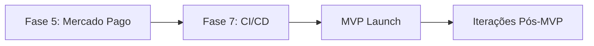

# 🎯 Orquestração do Projeto Realizah

**Agente Orquestrador:** Ativo  
**Data:** 2026-03-07  
**Versão:** 0.6.2

---

## 📊 Status Atual (Snapshot)

### Progresso Geral

- **Fases Completas:** 7/8 (87%)
- **LOC Implementadas:** ~21.000 linhas
- **Backend:** ✅ 100% Completo (4 módulos)
- **Frontend:** ✅ 100% Completo (15+ páginas)
- **Integração Medusa ↔ Storefront:** ✅ Produtos e categorias com seed realista (16 produtos, 8
  categorias)
- **Integrações:** ✅ Mercado Pago reativado (packages/mercadopago-provider)

### Módulos Backend

| Módulo           | Status   | Entidades | Services | APIs   | Events |
| ---------------- | -------- | --------- | -------- | ------ | ------ |
| Subscription     | ✅       | 3         | 3        | 8      | 4      |
| Access Control   | ✅       | 3         | 1        | 4      | 2      |
| Course           | ✅       | 6         | 9        | 12     | 5      |
| Digital Delivery | ✅       | 4         | 6        | 18     | 9      |
| **TOTAL**        | **100%** | **16**    | **19**   | **42** | **20** |

### Frontend Storefront

| Área      | Status   | Páginas | Componentes |
| --------- | -------- | ------- | ----------- |
| Public    | ✅       | 5       | 8           |
| Auth      | ✅       | 2       | 4           |
| Members   | ✅       | 8       | 12          |
| **TOTAL** | **100%** | **15**  | **24**      |

### Testes E2E (2026-03-07)

| Item                                                               | Status |
| ------------------------------------------------------------------ | ------ |
| Playwright configurado                                             | ✅     |
| Specs: home, auth, products, cart, checkout, subscription, courses | ✅     |
| Script `pnpm e2e`                                                  | ✅     |
| Doc `docs/testing/e2e.md`                                          | ✅     |

### Integração Medusa ↔ Storefront (2026-03-06)

| Item                     | Status                                |
| ------------------------ | ------------------------------------- |
| Seed realista (produtos) | ✅ 16 produtos, variantes, preços BRL |
| Seed categorias          | ✅ 8 categorias                       |
| Seed coleções (brands)   | ✅ 6 coleções                         |
| API produtos + preços    | ✅ Store API com `region_id`          |
| API categorias           | ✅ `/store/product-categories`        |
| Publishable API Key      | ✅ Gerada e linkada ao sales channel  |
| Fallback para mock       | ✅ Se Medusa offline, usa mock        |

### Medusa Backend (2026-03-06)

| Item                            | Status                                                            |
| ------------------------------- | ----------------------------------------------------------------- |
| Upgrade para v2.13.3            | ✅ framework, medusa, types, utils                                |
| Migrations executadas           | ✅ schema atualizado (deleted_at, links)                          |
| Config Payment Module           | ✅ Mercado Pago como provider (@realizah/mercadopago-provider)     |
| Middlewares (defineMiddlewares) | ✅ Corrigido                                                      |
| Medusa dev inicia               | ✅ Desbloqueado — moduleResolution node16, exclude \_api_disabled |

---

## 🎯 Fluxo Contínuo Definido

### Estratégia Escolhida: **Sequencial Focado**



**Justificativa:**

1. ✅ Backend e Frontend 100% completos
2. 🔴 Mercado Pago é bloqueador crítico (sem pagamentos = sem receita)
3. 🟡 CI/CD necessário para deploy seguro
4. ⚡ Foco total em cada fase = qualidade máxima

---

## 📋 Fase 5: Integração Mercado Pago (PRÓXIMA)

### Informações Gerais

- **Prioridade:** 🔴 Crítica (Bloqueador para MVP)
- **Duração Estimada:** 3-4 dias
- **Responsável:** A definir
- **Dependências:** ✅ Todas resolvidas
- **⚠️ Blockers:** Nenhum ativo. Mercado Pago reativado via `@realizah/mercadopago-provider`.

### Objetivos

1. Integrar pagamentos PIX, cartão e boleto
2. Implementar assinaturas recorrentes
3. Configurar webhooks para sincronização
4. Testar extensivamente com sandbox

### Checklist de Implementação

#### Dia 1: Setup e Estrutura

- [ ] Criar branch `feature/fase5-mercado-pago`
- [ ] Obter credenciais sandbox Mercado Pago
- [ ] Criar especificação técnica (se não existir)
- [ ] Criar estrutura de módulo:
  - [ ] `apps/medusa/src/modules/mercado-pago/`
  - [ ] `models/`, `services/`, `api/`, `webhooks/`
- [ ] Instalar SDK Mercado Pago: `pnpm add mercadopago`
- [ ] Criar tipos no `@realizah/types`
- [ ] Configurar variáveis de ambiente

#### Dia 2: Checkout PIX e Cartão

- [ ] Implementar `MercadoPagoService`
- [ ] Criar checkout PIX
  - [ ] Gerar QR Code
  - [ ] Retornar código PIX copia-e-cola
  - [ ] Polling de status
- [ ] Criar checkout cartão
  - [ ] Tokenização de cartão
  - [ ] Processamento de pagamento
  - [ ] Tratamento de erros
- [ ] Criar APIs admin/store
  - [ ] `POST /store/checkout/pix`
  - [ ] `POST /store/checkout/card`
- [ ] Testes com sandbox

#### Dia 3: Boleto e Assinaturas

- [ ] Criar checkout boleto
  - [ ] Gerar boleto
  - [ ] Retornar URL e código de barras
- [ ] Implementar assinaturas recorrentes
  - [ ] Criar plano de assinatura no MP
  - [ ] Vincular com SubscriptionPlan
  - [ ] Auto-renovação
- [ ] Criar APIs
  - [ ] `POST /store/checkout/boleto`
  - [ ] `POST /store/subscriptions/mercadopago`
- [ ] Testes com sandbox

#### Dia 4: Webhooks e Finalização

- [ ] Implementar webhooks
  - [ ] `POST /webhooks/mercadopago`
  - [ ] Validação de assinatura
  - [ ] Processamento de eventos:
    - [ ] `payment.created`
    - [ ] `payment.updated`
    - [ ] `payment.approved`
    - [ ] `payment.rejected`
- [ ] Integrar com módulos existentes
  - [ ] Subscription: ativar/cancelar
  - [ ] Digital Delivery: ativar compras
  - [ ] Course: ativar enrollments
- [ ] Implementar retry de pagamentos
- [ ] Criar seed de configurações
- [ ] Documentação
  - [ ] ADR 0007
  - [ ] CHANGELOG v0.6.0
  - [ ] README do módulo
- [ ] Testes finais
- [ ] Commit e merge

### Entregas Esperadas

- ✅ Pagamentos PIX funcionando
- ✅ Pagamentos cartão funcionando
- ✅ Pagamentos boleto funcionando
- ✅ Assinaturas recorrentes funcionando
- ✅ Webhooks configurados e testados
- ✅ Integração com módulos existentes
- ✅ Documentação completa

### Critérios de Aceitação

1. ✅ Cliente consegue pagar com PIX
2. ✅ Cliente consegue pagar com cartão
3. ✅ Cliente consegue pagar com boleto
4. ✅ Assinatura é renovada automaticamente
5. ✅ Webhooks atualizam status corretamente
6. ✅ Compras de produtos digitais são ativadas
7. ✅ Enrollments de cursos são ativados
8. ✅ Testes com sandbox passando
9. ✅ Documentação completa (ADR + CHANGELOG)

### Riscos e Mitigações

| Risco                             | Probabilidade | Impacto | Mitigação                        |
| --------------------------------- | ------------- | ------- | -------------------------------- |
| Credenciais sandbox indisponíveis | Baixa         | Alto    | Solicitar com antecedência       |
| Webhooks não chegam               | Média         | Alto    | Usar ngrok para testes locais    |
| Assinaturas recorrentes complexas | Média         | Médio   | Estudar docs MP com antecedência |
| Erros de integração               | Média         | Médio   | Testes extensivos com sandbox    |

---

## 📋 Fase 7: CI/CD e Deploy (APÓS FASE 5)

### Informações Gerais

- **Prioridade:** 🟡 Alta (Necessário para produção)
- **Duração Estimada:** 2-3 dias
- **Responsável:** DevOps / Agente Principal
- **Dependências:** 🔴 Fase 5 completa

### Objetivos

1. Configurar pipeline CI/CD completo
2. Deploy automático em staging e production
3. Configurar monitoramento e alertas
4. Garantir backup e disaster recovery

### Checklist de Implementação

#### Dia 1: GitHub Actions e Staging

- [ ] Criar workflows GitHub Actions
  - [ ] `.github/workflows/ci.yml` (build, lint, test)
  - [ ] `.github/workflows/deploy-staging.yml`
  - [ ] `.github/workflows/deploy-production.yml`
- [ ] Configurar ambientes no GitHub
  - [ ] `staging` (auto-deploy em push para `develop`)
  - [ ] `production` (manual approval)
- [ ] Setup Railway/Render para Medusa (staging)
  - [ ] PostgreSQL
  - [ ] Redis (se necessário)
  - [ ] Variáveis de ambiente
- [ ] Setup Vercel para Storefront (staging)
  - [ ] Variáveis de ambiente
  - [ ] Preview deployments
- [ ] Testar deploy staging

#### Dia 2: Production e S3

- [ ] Setup Railway/Render para Medusa (production)
  - [ ] PostgreSQL (com backup automático)
  - [ ] Variáveis de ambiente
- [ ] Setup Vercel para Storefront (production)
  - [ ] Custom domain
  - [ ] Variáveis de ambiente
- [ ] Configurar AWS S3
  - [ ] Bucket para digital-delivery
  - [ ] IAM policies
  - [ ] Encryption at rest
  - [ ] Lifecycle policies
- [ ] Integrar S3 no código (substituir mock)
- [ ] Testar upload/download em staging

#### Dia 3: Monitoramento e Finalização

- [ ] Configurar Sentry
  - [ ] Backend (Medusa)
  - [ ] Frontend (Storefront)
  - [ ] Source maps
- [ ] Configurar backup PostgreSQL
  - [ ] Backup diário automático
  - [ ] Retenção 30 dias
- [ ] Configurar alertas
  - [ ] Erros críticos (Sentry)
  - [ ] Downtime (UptimeRobot)
  - [ ] Disk space (Railway/Render)
- [ ] Documentação
  - [ ] Deploy guide
  - [ ] Runbook (troubleshooting)
  - [ ] Environment variables guide
- [ ] Deploy production inicial
- [ ] Smoke tests production

### Entregas Esperadas

- ✅ Pipeline CI/CD funcionando
- ✅ Deploy automático (staging)
- ✅ Deploy manual com approval (production)
- ✅ S3 integrado e funcionando
- ✅ Monitoramento configurado (Sentry)
- ✅ Backup automático configurado
- ✅ Documentação de deploy

### Critérios de Aceitação

1. ✅ Push para `develop` → auto-deploy staging
2. ✅ Merge para `main` → manual deploy production
3. ✅ Testes E2E rodando no CI
4. ✅ S3 funcionando (upload/download real)
5. ✅ Sentry capturando erros
6. ✅ Backup diário funcionando
7. ✅ Documentação completa

---

## 🚀 Timeline para MVP

### Cenário Realista (Sequencial)

```
Hoje (Dia 0): Orquestração completa ✅
Dia 1-4:      Fase 5 (Mercado Pago)
Dia 5-7:      Fase 7 (CI/CD)
Dia 8:        Testes finais
Dia 9:        Soft launch (beta)
Dia 10:       MVP Launch 🚀
```

**Data Prevista MVP:** 2026-03-15 (10 dias)

### Cenário Otimista (Paralelo - 2 agentes)

```
Hoje (Dia 0): Orquestração completa ✅
Dia 1-4:      Fase 5 (Mercado Pago) + Fase 7 (CI/CD) em paralelo
Dia 5:        Testes finais
Dia 6:        Soft launch (beta)
Dia 7:        MVP Launch 🚀
```

**Data Prevista MVP:** 2026-03-12 (7 dias)

---

## 📊 Métricas de Sucesso

### Fase 5 (Mercado Pago)

- [ ] Taxa de conversão de checkout > 80%
- [ ] Tempo médio de checkout < 2 minutos
- [ ] Taxa de falha de pagamento < 5%
- [ ] Webhooks processados em < 5 segundos
- [ ] 0 pagamentos perdidos (sincronização 100%)

### Fase 7 (CI/CD)

- [ ] Deploy time < 10 minutos
- [ ] Uptime > 99.5%
- [ ] MTTR (Mean Time To Recovery) < 1 hora
- [ ] Backup success rate 100%
- [ ] 0 deploys com rollback

### MVP Launch

- [ ] Todas as features funcionando
- [ ] Performance: Lighthouse score > 90
- [ ] Security: 0 vulnerabilidades críticas
- [ ] SEO: Todas as páginas indexáveis
- [ ] Mobile: 100% responsivo

---

## 🔄 Processo de Iteração Pós-MVP

### Ciclo de Feedback

```
Launch → Monitorar → Coletar Feedback → Priorizar → Implementar → Deploy
```

### Melhorias Planejadas (Backlog)

1. ~~**Desbloquear Medusa dev**~~ ✅ (2026-03-07)
   - Resolvido: moduleResolution node16, exclude _api_disabled, Zod overrides

2. ~~**Reativar Mercado Pago provider**~~ ✅ (2026-03-07)
   - Extraído para `packages/mercadopago-provider`, config usa path.resolve

3. **Re-ativar rotas customizadas Medusa** (Prioridade: Alta)
   - Rotas em `_api_disabled/` (admin, store: courses, subscriptions, payments, webhooks)
   - Depende de Medusa dev estável
   - Ver: `apps/medusa/src/_api_disabled/`

4. **Admin Dashboard** (Prioridade: Alta)
   - Interface web para admin
   - Analytics e métricas
   - Gestão de usuários

5. **Email Service** (Prioridade: Alta)
   - SendGrid/Mailgun integration
   - Templates de email
   - Notificações automáticas

6. **Testes Backend** (Prioridade: Média)
   - Testes unitários
   - Testes de integração
   - Coverage > 80%

7. **Performance Optimization** (Prioridade: Média)
   - Caching (Redis)
   - CDN para assets
   - Database query optimization

8. **Features Avançadas** (Prioridade: Baixa)
   - Gamificação
   - Social features
   - Mobile app
   - AI recommendations

---

## 📞 Comunicação e Governança

### Daily Standup (Assíncrono)

- **O que foi feito ontem?**
- **O que será feito hoje?**
- **Há algum bloqueador?**

### Weekly Review

- **Progresso da semana**
- **Métricas de qualidade**
- **Ajustes no roadmap**

### Documentação Obrigatória

- [ ] ADR para decisões arquiteturais
- [ ] CHANGELOG para cada release
- [ ] README para cada módulo
- [ ] API docs para endpoints

### Git Workflow

```
main (production)
  ↑
develop (staging)
  ↑
feature/* (desenvolvimento)
```

**Regras:**

- Feature branches a partir de `develop`
- PR obrigatório com review
- Testes devem passar no CI
- Conventional commits obrigatório

---

## 🎯 Decisão Final do Orquestrador

### Próxima Ação Imediata

**ATACAR BACKLOG — Fase 5 concluída**

**Prioridade 1:** Restaurar rotas de `_api_disabled/` para `api/` (quando build permitir)  
**Prioridade 2:** Fase 7 — CI/CD (GitHub Actions: build, lint, E2E)  
**Prioridade 3:** Admin Dashboard, Email Service, Testes Backend

**Comando para CI:** `.github/workflows/ci.yml` criado

**Prazo:** Fase 7 em 2-3 dias

---

## 📝 Notas do Orquestrador

### Pontos Fortes do Projeto

✅ **Arquitetura sólida:** Event-driven, modular, escalável  
✅ **Código de qualidade:** TypeScript strict, ESLint, Prettier  
✅ **Documentação completa:** ADRs, specs, CHANGELOG  
✅ **Testes E2E:** Playwright configurado  
✅ **Git workflow:** Husky, commitlint, conventional commits

### Áreas de Atenção

🟡 **Rotas customizadas Medusa:** Admin, courses, subscriptions, webhooks em `_api_disabled/` —
reativar quando Medusa RC suportar módulos locais  
🟡 **Testes Backend:** Sem cobertura ainda (post-MVP)  
🟡 **S3 Mock:** Requer integração real na Fase 7  
🟡 **Email Service:** TODOs espalhados (post-MVP)  
🟡 **Performance:** Não testado com carga (post-MVP)

### Recomendações

1. **Fase 5 concluída:** Mercado Pago reativado — foco em Fase 7 (CI/CD)
2. **Testes extensivos:** Sandbox deve simular produção
3. **Documentação contínua:** ADR e CHANGELOG obrigatórios
4. **Code review:** Mesmo trabalhando solo, revisar código
5. **Commits frequentes:** Pequenos e atômicos

---

**Status:** 🟢 Orquestração Completa  
**Última atualização:** 2026-03-07 — Medusa dev OK, Mercado Pago reativado, CI workflow criado, próximo: rotas + deploy  
**Próximo Update:** Após Fase 7 CI/CD  
**Contato:** Consultar [CONTRIBUTING.md](../CONTRIBUTING.md)
