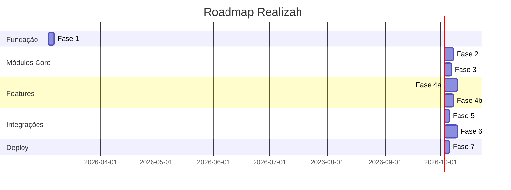

# Roadmap de Implementação — Realizah

Roadmap completo do projeto Realizah, desde a fundação até o lançamento.

---

## 🎯 Visão Geral



---

## 📋 Fases Detalhadas

### ✅ Fase 0: Documentação (CONCLUÍDA)

**Status:** ✅ Completa  
**Duração:** Concluída

**Entregas:**

- [x] Documentação completa do projeto
- [x] ADRs e especificações técnicas
- [x] Convenções de código e workflow
- [x] Estrutura para IA (CLAUDE.md, Cursor rules)
- [x] Governança (CONTRIBUTING.md, templates)
- [x] Controle de versão (commitlint, husky)

---

### ✅ Fase 1: Setup do Monorepo (COMPLETA)

**Status:** ✅ Completa  
**Duração real:** 1 dia  
**Data conclusão:** 2026-03-04

**Objetivo:** Estabelecer fundação completa do monorepo.

**Tarefas:**

- [x] Inicializar Git e instalar Husky
- [x] Criar estrutura de pastas
- [x] Configurar pnpm workspace
- [x] Setup @realizah/types
- [x] Setup @realizah/utils
- [x] Setup @realizah/tsconfig
- [x] Setup Medusa v2
- [x] Setup PostgreSQL
- [x] Setup Next.js 15
- [x] Testar ambiente de desenvolvimento
- [x] Commit e documentação

**Entregas:**

- ✅ Monorepo funcional com Turborepo
- ✅ Medusa v2 rodando
- ✅ Next.js 15 rodando
- ✅ Packages compartilhados
- ✅ PostgreSQL configurado

**Documentação:**

- [ADR 0002](adr/0002-fase1-monorepo-setup.md)

---

### ✅ Fase 2: Subscription Module (COMPLETA)

**Status:** ✅ Completa  
**Duração real:** 1 dia  
**Data conclusão:** 2026-03-04

**Objetivo:** Implementar gestão completa de assinaturas.

**Tarefas:**

- [x] Criar entidades (SubscriptionPlan, Subscription, SubscriptionInvoice)
- [x] Criar migrations
- [x] Implementar SubscriptionService
- [x] Implementar APIs admin (CRUD de planos)
- [x] Implementar APIs store (assinar, cancelar, reativar)
- [x] Implementar eventos (created, updated, canceled, renewed)
- [x] Implementar lógica de renovação
- [x] Documentação da API

**Entregas:**

- ✅ Módulo subscription completo (3 entidades, 3 services, 8 APIs)
- ✅ APIs funcionais
- ✅ Documentação atualizada

**Documentação:**

- [ADR 0003](adr/0003-fase2-subscription-module.md)
- [Subscription Module Spec](specs/subscription-module.md)

---

### ✅ Fase 3: Access Control Module (COMPLETA)

**Status:** ✅ Completa  
**Duração real:** 1 dia  
**Data conclusão:** 2026-03-04

**Objetivo:** Implementar controle de acesso por tier.

**Tarefas:**

- [x] Criar entidades (Feature, AccessRule, CustomerAccess)
- [x] Criar migrations
- [x] Implementar AccessControlService
- [x] Implementar verificação de acesso (hasAccess)
- [x] Implementar listeners de eventos de subscription
- [x] Implementar middleware de verificação
- [x] Implementar APIs admin e store
- [x] Criar features padrão (seed)
- [x] Documentação da API

**Entregas:**

- ✅ Módulo access-control completo (3 entidades, 1 service, 4 APIs)
- ✅ Integração com subscription (event-driven)
- ✅ Middleware funcionando
- ✅ Features padrão criadas

**Documentação:**

- [ADR 0004](adr/0004-fase3-access-control-module.md)
- [Access Control Module Spec](specs/access-control-module.md)

---

### ✅ Fase 4a: Course Module (COMPLETA)

**Status:** ✅ Completa  
**Duração real:** 1 dia  
**Data conclusão:** 2026-03-04

**Objetivo:** Implementar plataforma LMS completa.

**Tarefas:**

- [x] Criar entidades (Course, CourseModule, Lesson, Enrollment, LessonProgress, CourseReview)
- [x] Criar migrations
- [x] Implementar CourseService (9 services)
- [x] Implementar sistema de progresso
- [x] Implementar sistema de quiz
- [x] Implementar geração de certificados
- [x] Integrar com Access Control
- [x] Implementar APIs admin e store (12 endpoints)
- [x] Documentação da API

**Entregas:**

- ✅ Módulo course completo (6 entidades, 9 services, 12 APIs)
- ✅ Sistema LMS funcional
- ✅ Certificados gerados (placeholder)
- ✅ Integração com access control

**Documentação:**

- [ADR 0005](adr/0005-fase4-course-module.md)
- [Course Module Spec](specs/course-module.md)

---

### ✅ Fase 4b: Digital Delivery Module (COMPLETA)

**Status:** ✅ Completa  
**Duração real:** 1 dia  
**Data conclusão:** 2026-03-05

**Objetivo:** Implementar entrega segura de produtos digitais.

**Tarefas:**

- [x] Criar entidades (DigitalProduct, DigitalFile, DigitalPurchase, DownloadLog)
- [x] Criar migrations
- [x] Implementar DigitalDeliveryService (6 services)
- [x] Integrar com S3 (upload e download - mock)
- [x] Implementar URLs assinadas
- [x] Integrar com eventos do Medusa (orders)
- [x] Implementar verificação de integridade (checksum SHA-256)
- [x] Implementar APIs admin e store (18 endpoints)
- [x] Documentação da API

**Entregas:**

- ✅ Módulo digital-delivery completo (4 entidades, 6 services, 18 APIs)
- ✅ Integração com S3 (mock - requer AWS SDK para produção)
- ✅ URLs assinadas funcionando (1h expiration)
- ✅ Integração com orders do Medusa (event-driven)

**Documentação:**

- [ADR 0006](adr/0006-fase5-digital-delivery-module.md)
- [Digital Delivery Module Spec](specs/digital-delivery-module.md)
- [Integration Tests](../apps/medusa/src/modules/digital-delivery/INTEGRATION_TESTS.md)

---

### ✅ Fase 5: Integração Mercado Pago (COMPLETA)

**Status:** ✅ Completa  
**Duração real:** 1 dia  
**Data conclusão:** 2026-03-05

**Objetivo:** Integrar pagamentos com Mercado Pago.

**Tarefas:**

- [x] Instalar SDK mercadopago@2.x
- [x] Implementar MercadoPagoProviderService (AbstractPaymentProvider)
- [x] Registrar provider no medusa-config.js
- [x] Implementar checkout PIX com QR code
- [x] Implementar checkout cartão de crédito (via Preference)
- [x] Implementar checkout boleto (via Preference)
- [x] Implementar assinaturas recorrentes (PreApproval)
- [x] Implementar webhooks POST /store/webhooks/mercadopago
- [x] Implementar refund
- [x] Documentação (ADR 0007)

**Entregas:**

- ✅ Payment provider completo (8 métodos obrigatórios implementados)
- ✅ PIX com QR code
- ✅ Assinaturas recorrentes via PreApproval
- ✅ Webhooks configurados
- ✅ ADR 0007 documentado

**Dependências:**

- ✅ Fase 2 completa (subscription)
- ✅ Fases 4a e 4b completas
- 🟡 Credenciais Mercado Pago (sandbox — a configurar em .env)

---

### ✅ Fase 6: Frontend Storefront (COMPLETA)

**Status:** ✅ Completa  
**Duração real:** 1 dia  
**Data conclusão:** 2026-03-05

**Objetivo:** Implementar interface completa da loja e área de membros.

**Tarefas:**

- [x] Design system e componentes UI (shadcn/ui + Tailwind)
- [x] Página inicial e navegação
- [x] Catálogo de produtos
- [x] Checkout e carrinho
- [x] Área de membros (dashboard)
- [x] Página de cursos
- [x] Player de vídeo e progresso
- [x] Página de downloads (produtos digitais)
- [x] Página de assinaturas
- [x] Autenticação e perfil
- [x] Responsividade mobile
- [x] Testes E2E (Playwright)
- [x] Otimização de performance (SEO, sitemap, robots)

**Entregas:**

- ✅ Storefront completo e funcional (15+ páginas)
- ✅ Área de membros (dashboard, courses, downloads, subscriptions)
- ✅ Interface responsiva (mobile-first)
- ✅ Performance otimizada (Next.js 15, App Router)
- ✅ Testes E2E (3 suítes: home, auth, products)

**Documentação:**

- [ADR 0006](adr/0006-fase6-frontend-storefront.md)

---

### ⏳ Fase 7: CI/CD e Deploy

**Status:** ⏳ Aguardando Fase 5  
**Duração estimada:** 2-3 dias  
**Prioridade:** 🟡 Média

**Objetivo:** Configurar pipeline de CI/CD e fazer deploy inicial.

**Tarefas:**

- [ ] Configurar GitHub Actions
  - [ ] Build e lint
  - [ ] Testes E2E
  - [ ] Deploy automático
- [ ] Setup de ambientes (staging, production)
- [ ] Configurar deploy do Medusa (Railway/Render)
- [ ] Configurar deploy do Storefront (Vercel)
- [ ] Configurar PostgreSQL em produção
- [ ] Configurar S3 em produção (AWS)
- [ ] Configurar variáveis de ambiente
- [ ] Configurar monitoramento (Sentry)
- [ ] Configurar backup de banco
- [ ] Documentação de deploy
- [ ] Deploy inicial

**Entregas:**

- Pipeline CI/CD funcionando
- Deploy automático (staging + production)
- Ambientes staging e production
- Monitoramento configurado

**Dependências:**

- ✅ Fase 6 completa
- 🔴 Fase 5 completa (Mercado Pago)

---

## 🔄 Estratégia de Paralelização

### Sequencial (Fases 1-3)

```
Fase 1 → Fase 2 → Fase 3
```

Estas fases devem ser executadas sequencialmente pois cada uma depende da anterior.

### Paralelo (Fase 4)

```
        ┌─→ Fase 4a (Course) ─┐
Fase 3 ─┤                      ├─→ Fase 5
        └─→ Fase 4b (Digital) ─┘
```

Após a Fase 3, as Fases 4a e 4b podem ser executadas em paralelo por agentes diferentes.

---

## 📊 Progresso Geral

| Fase                 | Status        | Progresso | Data Conclusão | LOC   |
| -------------------- | ------------- | --------- | -------------- | ----- |
| 0. Documentação      | ✅ Completa   | 100%      | 2026-03-04     | -     |
| 1. Setup Monorepo    | ✅ Completa   | 100%      | 2026-03-04     | ~500  |
| 2. Subscription      | ✅ Completa   | 100%      | 2026-03-04     | ~1800 |
| 3. Access Control    | ✅ Completa   | 100%      | 2026-03-04     | ~1500 |
| 4a. Course           | ✅ Completa   | 100%      | 2026-03-04     | ~3200 |
| 4b. Digital Delivery | ✅ Completa   | 100%      | 2026-03-05     | ~4800 |
| 5. Mercado Pago      | ✅ Completa   | 100%      | 2026-03-05     | ~600  |
| 6. Frontend          | ✅ Completa   | 100%      | 2026-03-05     | ~8000 |
| 7. CI/CD e Deploy    | ⏳ Aguardando | 0%        | -              | -     |

**Total Implementado:** ~20.600 linhas de código | **Fases Completas:** 7/8 (87%)

---

## 🎯 Milestones

### M1: Fundação Completa

- **Data alvo:** Após Fase 1
- **Critério:** Monorepo funcional, Medusa e Next.js rodando

### M2: Backend Core Completo

- **Data alvo:** Após Fase 3
- **Critério:** Subscription e Access Control funcionando

### M3: Features Completas

- **Data alvo:** Após Fases 4a e 4b
- **Critério:** Course e Digital Delivery funcionando

### M4: Pagamentos Integrados

- **Data alvo:** Após Fase 5
- **Critério:** Mercado Pago funcionando com todos os métodos

### M5: MVP Completo

- **Data alvo:** Após Fase 6
- **Critério:** Frontend completo e funcional

### M6: Produção

- **Data alvo:** Após Fase 7
- **Critério:** Deploy em produção com CI/CD

---

## 📝 Notas

### Estimativas

As estimativas de duração são baseadas em:

- Complexidade técnica de cada módulo
- Dependências entre módulos
- Tempo para testes e documentação

### Flexibilidade

O roadmap é flexível e pode ser ajustado conforme:

- Feedback durante implementação
- Descoberta de requisitos adicionais
- Mudanças de prioridade

### Documentação

Cada fase tem:

- Especificação técnica detalhada em `docs/specs/`
- Plano de implementação (quando aplicável)
- ADRs para decisões importantes

---

## 🔗 Links Úteis

- [Plano Detalhado Fase 1](plans/2026-03-04-fase1-setup-monorepo.md)
- [Quick Start Fase 1](plans/QUICK-START-FASE1.md)
- [Especificações dos Módulos](specs/)
- [ADRs](adr/)
- [Convenções](conventions/)
- [CONTRIBUTING.md](../CONTRIBUTING.md)

---

## 📈 Status Atual

**Versão:** 0.5.0  
**Última atualização:** 2026-03-05  
**Status geral:** 🟢 **Backend 100% | Frontend 100% | Pagamentos 100% | Próxima: CI/CD**

**Progresso:** 7/8 fases completas (87%)  
**LOC Implementadas:** ~20.000 linhas  
**Commits:** 24 commits  
**Timeline MVP:** 5-7 dias (Fase 5 + Fase 7)

**Relatório Detalhado:** [STATUS_REPORT.md](STATUS_REPORT.md)
