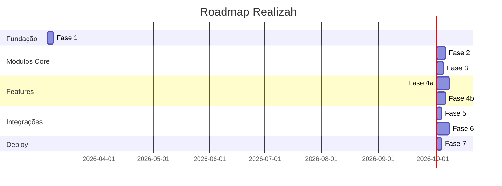

# Roadmap de Implementação — Realizah

Roadmap completo do projeto Realizah, desde a fundação até o lançamento.

---

## 🎯 Visão Geral



---

## 📋 Fases Detalhadas

### ✅ Fase 0: Documentação (CONCLUÍDA)

**Status:** ✅ Completa  
**Duração:** Concluída

**Entregas:**
- [x] Documentação completa do projeto
- [x] ADRs e especificações técnicas
- [x] Convenções de código e workflow
- [x] Estrutura para IA (CLAUDE.md, Cursor rules)
- [x] Governança (CONTRIBUTING.md, templates)
- [x] Controle de versão (commitlint, husky)

---

### 🚧 Fase 1: Setup do Monorepo (ATUAL)

**Status:** 🚧 Em Progresso  
**Duração estimada:** 2-3 dias  
**Responsável:** Agente Principal

**Objetivo:** Estabelecer fundação completa do monorepo.

**Tarefas:**
- [ ] Inicializar Git e instalar Husky
- [ ] Criar estrutura de pastas
- [ ] Configurar pnpm workspace
- [ ] Setup @realizah/types
- [ ] Setup @realizah/utils
- [ ] Setup @realizah/tsconfig
- [ ] Setup Medusa v2
- [ ] Setup PostgreSQL
- [ ] Setup Next.js 15
- [ ] Testar ambiente de desenvolvimento
- [ ] Commit e documentação

**Entregas:**
- Monorepo funcional com Turborepo
- Medusa v2 rodando
- Next.js 15 rodando
- Packages compartilhados
- PostgreSQL configurado

**Documentação:**
- [Plano Detalhado](plans/2026-03-04-fase1-setup-monorepo.md)
- [Quick Start](plans/QUICK-START-FASE1.md)

---

### 📦 Fase 2: Subscription Module

**Status:** ⏳ Aguardando Fase 1  
**Duração estimada:** 4-5 dias  
**Responsável:** Agente 1

**Objetivo:** Implementar gestão completa de assinaturas.

**Tarefas:**
- [ ] Criar entidades (SubscriptionPlan, Subscription, SubscriptionInvoice)
- [ ] Criar migrations
- [ ] Implementar SubscriptionService
- [ ] Implementar APIs admin (CRUD de planos)
- [ ] Implementar APIs store (assinar, cancelar, reativar)
- [ ] Implementar eventos (created, updated, canceled, renewed)
- [ ] Implementar lógica de renovação
- [ ] Testes unitários e integração (>80% coverage)
- [ ] Documentação da API

**Entregas:**
- Módulo subscription completo
- APIs funcionais
- Testes passando
- Documentação atualizada

**Dependências:**
- Fase 1 completa

**Especificação:**
- [Subscription Module Spec](specs/subscription-module.md)

---

### 🔐 Fase 3: Access Control Module

**Status:** ⏳ Aguardando Fase 2  
**Duração estimada:** 3-4 dias  
**Responsável:** Agente 2

**Objetivo:** Implementar controle de acesso por tier.

**Tarefas:**
- [ ] Criar entidades (Feature, AccessRule, CustomerAccess)
- [ ] Criar migrations
- [ ] Implementar AccessControlService
- [ ] Implementar verificação de acesso (hasAccess)
- [ ] Implementar listeners de eventos de subscription
- [ ] Implementar middleware de verificação
- [ ] Implementar APIs admin e store
- [ ] Criar features padrão (seed)
- [ ] Testes unitários e integração
- [ ] Documentação da API

**Entregas:**
- Módulo access-control completo
- Integração com subscription
- Middleware funcionando
- Features padrão criadas

**Dependências:**
- Fase 2 completa (subscription events)

**Especificação:**
- [Access Control Module Spec](specs/access-control-module.md)

---

### 📚 Fase 4a: Course Module (Paralelo)

**Status:** ⏳ Aguardando Fase 3  
**Duração estimada:** 6-7 dias  
**Responsável:** Agente 3

**Objetivo:** Implementar plataforma LMS completa.

**Tarefas:**
- [ ] Criar entidades (Course, CourseModule, Lesson, Enrollment, LessonProgress)
- [ ] Criar migrations
- [ ] Implementar CourseService
- [ ] Implementar sistema de progresso
- [ ] Implementar sistema de quiz
- [ ] Implementar geração de certificados
- [ ] Integrar com Access Control
- [ ] Implementar APIs admin e store
- [ ] Testes unitários e integração
- [ ] Documentação da API

**Entregas:**
- Módulo course completo
- Sistema LMS funcional
- Certificados gerados
- Integração com access control

**Dependências:**
- Fase 3 completa (access control)

**Especificação:**
- [Course Module Spec](specs/course-module.md)

---

### 📥 Fase 4b: Digital Delivery Module (Paralelo)

**Status:** ⏳ Aguardando Fase 3  
**Duração estimada:** 4-5 dias  
**Responsável:** Agente 4

**Objetivo:** Implementar entrega segura de produtos digitais.

**Tarefas:**
- [ ] Criar entidades (DigitalProduct, DigitalFile, DigitalPurchase, DownloadLog)
- [ ] Criar migrations
- [ ] Implementar DigitalDeliveryService
- [ ] Integrar com S3 (upload e download)
- [ ] Implementar URLs assinadas
- [ ] Integrar com eventos do Medusa (orders)
- [ ] Implementar verificação de integridade (checksum)
- [ ] Implementar APIs admin e store
- [ ] Testes unitários e integração
- [ ] Documentação da API

**Entregas:**
- Módulo digital-delivery completo
- Integração com S3
- URLs assinadas funcionando
- Integração com orders do Medusa

**Dependências:**
- Fase 3 completa (access control)
- Pode rodar em paralelo com Fase 4a

**Especificação:**
- [Digital Delivery Module Spec](specs/digital-delivery-module.md)

---

### 💳 Fase 5: Integração Mercado Pago

**Status:** ⏳ Aguardando Fases 4a e 4b  
**Duração estimada:** 3-4 dias  
**Responsável:** Agente 1 ou 2

**Objetivo:** Integrar pagamentos com Mercado Pago.

**Tarefas:**
- [ ] Configurar credenciais Mercado Pago
- [ ] Implementar checkout PIX
- [ ] Implementar checkout cartão
- [ ] Implementar checkout boleto
- [ ] Implementar assinaturas recorrentes
- [ ] Implementar webhooks
- [ ] Implementar retry de pagamentos
- [ ] Testes com sandbox
- [ ] Documentação

**Entregas:**
- Pagamentos funcionando (PIX, cartão, boleto)
- Assinaturas recorrentes
- Webhooks configurados

**Dependências:**
- Fase 2 completa (subscription)
- Fases 4a e 4b completas

---

### 🎨 Fase 6: Frontend Storefront

**Status:** ⏳ Aguardando Fase 5  
**Duração estimada:** 6-7 dias  
**Responsável:** Agente 3 ou novo agente

**Objetivo:** Implementar interface completa da loja e área de membros.

**Tarefas:**
- [ ] Design system e componentes UI
- [ ] Página inicial e navegação
- [ ] Catálogo de produtos
- [ ] Checkout e carrinho
- [ ] Área de membros (dashboard)
- [ ] Página de cursos
- [ ] Player de vídeo e progresso
- [ ] Página de downloads (produtos digitais)
- [ ] Página de assinaturas
- [ ] Autenticação e perfil
- [ ] Responsividade mobile
- [ ] Testes E2E
- [ ] Otimização de performance

**Entregas:**
- Storefront completo e funcional
- Área de membros
- Interface responsiva
- Performance otimizada

**Dependências:**
- Todas as fases anteriores completas
- APIs backend funcionando

---

### 🚀 Fase 7: CI/CD e Deploy

**Status:** ⏳ Aguardando Fase 6  
**Duração estimada:** 2-3 dias  
**Responsável:** DevOps / Agente Principal

**Objetivo:** Configurar pipeline de CI/CD e fazer deploy inicial.

**Tarefas:**
- [ ] Configurar GitHub Actions
- [ ] Setup de ambientes (staging, production)
- [ ] Configurar deploy do Medusa
- [ ] Configurar deploy do Storefront (Vercel ou similar)
- [ ] Configurar PostgreSQL em produção
- [ ] Configurar S3 em produção
- [ ] Configurar variáveis de ambiente
- [ ] Configurar monitoramento (Sentry, etc.)
- [ ] Configurar backup de banco
- [ ] Documentação de deploy
- [ ] Deploy inicial

**Entregas:**
- Pipeline CI/CD funcionando
- Deploy automático
- Ambientes staging e production
- Monitoramento configurado

**Dependências:**
- Fase 6 completa
- Todas as features implementadas

---

## 🔄 Estratégia de Paralelização

### Sequencial (Fases 1-3)

```
Fase 1 → Fase 2 → Fase 3
```

Estas fases devem ser executadas sequencialmente pois cada uma depende da anterior.

### Paralelo (Fase 4)

```
        ┌─→ Fase 4a (Course) ─┐
Fase 3 ─┤                      ├─→ Fase 5
        └─→ Fase 4b (Digital) ─┘
```

Após a Fase 3, as Fases 4a e 4b podem ser executadas em paralelo por agentes diferentes.

---

## 📊 Progresso Geral

| Fase | Status | Progresso | Responsável |
|------|--------|-----------|-------------|
| 0. Documentação | ✅ Completa | 100% | Concluída |
| 1. Setup Monorepo | 🚧 Em Progresso | 0% | Agente Principal |
| 2. Subscription | ⏳ Aguardando | 0% | Agente 1 |
| 3. Access Control | ⏳ Aguardando | 0% | Agente 2 |
| 4a. Course | ⏳ Aguardando | 0% | Agente 3 |
| 4b. Digital Delivery | ⏳ Aguardando | 0% | Agente 4 |
| 5. Mercado Pago | ⏳ Aguardando | 0% | TBD |
| 6. Frontend | ⏳ Aguardando | 0% | TBD |
| 7. CI/CD e Deploy | ⏳ Aguardando | 0% | TBD |

---

## 🎯 Milestones

### M1: Fundação Completa
- **Data alvo:** Após Fase 1
- **Critério:** Monorepo funcional, Medusa e Next.js rodando

### M2: Backend Core Completo
- **Data alvo:** Após Fase 3
- **Critério:** Subscription e Access Control funcionando

### M3: Features Completas
- **Data alvo:** Após Fases 4a e 4b
- **Critério:** Course e Digital Delivery funcionando

### M4: Pagamentos Integrados
- **Data alvo:** Após Fase 5
- **Critério:** Mercado Pago funcionando com todos os métodos

### M5: MVP Completo
- **Data alvo:** Após Fase 6
- **Critério:** Frontend completo e funcional

### M6: Produção
- **Data alvo:** Após Fase 7
- **Critério:** Deploy em produção com CI/CD

---

## 📝 Notas

### Estimativas

As estimativas de duração são baseadas em:
- Complexidade técnica de cada módulo
- Dependências entre módulos
- Tempo para testes e documentação

### Flexibilidade

O roadmap é flexível e pode ser ajustado conforme:
- Feedback durante implementação
- Descoberta de requisitos adicionais
- Mudanças de prioridade

### Documentação

Cada fase tem:
- Especificação técnica detalhada em `docs/specs/`
- Plano de implementação (quando aplicável)
- ADRs para decisões importantes

---

## 🔗 Links Úteis

- [Plano Detalhado Fase 1](plans/2026-03-04-fase1-setup-monorepo.md)
- [Quick Start Fase 1](plans/QUICK-START-FASE1.md)
- [Especificações dos Módulos](specs/)
- [ADRs](adr/)
- [Convenções](conventions/)
- [CONTRIBUTING.md](../CONTRIBUTING.md)

---

**Última atualização:** 2026-03-04  
**Status geral:** 🚧 Fase 1 em progresso
