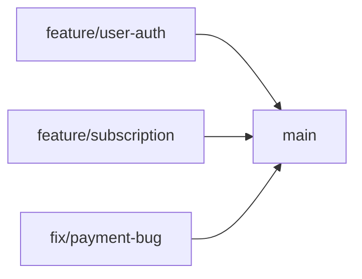

# Git Workflow

Estratégia de branching, commits e versionamento do projeto Realizah.

## Estratégia de Branching

Utilizamos **Trunk-Based Development** — uma abordagem simples e eficiente para times pequenos a médios.



### Branches

| Branch | Propósito | Proteção |
|--------|-----------|----------|
| `main` | Branch principal, sempre deployável | Requer PR + aprovação |
| `feature/<nome>` | Desenvolvimento de features | Nenhuma |
| `fix/<nome>` | Correções de bugs | Nenhuma |
| `chore/<nome>` | Manutenção, refatoração | Nenhuma |

### Regras

- **Branches de curta duração**: idealmente < 2 dias
- **Merge frequente**: integre com `main` o mais rápido possível
- **Sempre atualizado**: faça rebase/merge de `main` antes de abrir PR
- **Delete após merge**: branches são deletadas após merge

## Conventional Commits

Seguimos a especificação [Conventional Commits](https://www.conventionalcommits.org/) para mensagens de commit estruturadas.

### Formato

```
<type>(<scope>): <description>

[optional body]

[optional footer(s)]
```

### Types

| Type | Uso | Exemplo |
|------|-----|---------|
| `feat` | Nova funcionalidade | `feat(subscription): add plan creation endpoint` |
| `fix` | Correção de bug | `fix(payment): resolve PIX callback timeout` |
| `docs` | Apenas documentação | `docs(readme): update installation steps` |
| `style` | Formatação, sem mudança de lógica | `style(button): fix indentation` |
| `refactor` | Refatoração sem mudança de comportamento | `refactor(auth): extract token validation` |
| `perf` | Melhoria de performance | `perf(query): add index to user_id` |
| `test` | Adição ou correção de testes | `test(user): add validation tests` |
| `chore` | Manutenção (deps, config) | `chore(deps): update medusa to v2.1` |
| `ci` | CI/CD | `ci(github): add test workflow` |
| `build` | Build system | `build(turbo): configure cache` |

### Scopes

Scopes identificam qual parte do projeto foi afetada:

**Apps:**
- `storefront` — Next.js storefront
- `medusa` — Backend Medusa

**Módulos:**
- `subscription` — subscription-module
- `access-control` — access-control-module
- `course` — course-module
- `digital-delivery` — digital-delivery-module

**Packages:**
- `types` — tipos compartilhados
- `utils` — utilitários compartilhados

**Outros:**
- `deps` — dependências
- `config` — configuração
- `docs` — documentação

### Exemplos

```bash
# Feature
feat(subscription): add plan creation endpoint

# Fix
fix(payment): resolve PIX callback timeout issue

Mercado Pago callbacks estavam expirando após 30s.
Aumentado timeout para 60s e adicionado retry.

Closes #123

# Breaking change
feat(auth)!: change JWT token structure

BREAKING CHANGE: Token payload agora inclui `role` em vez de `permissions`.
Clientes precisam atualizar parsing de token.

# Multiple scopes
feat(storefront,medusa): add product search
```

### Regras

- **Primeira linha**: máximo 72 caracteres
- **Imperativo**: "add" não "added" ou "adds"
- **Minúsculas**: type e scope em lowercase
- **Sem ponto final**: na description
- **Body opcional**: para contexto adicional
- **Footer**: para breaking changes e referências a issues

## Workflow de Desenvolvimento

### 1. Criar Branch

```bash
# Atualizar main
git checkout main
git pull origin main

# Criar feature branch
git checkout -b feature/subscription-plans

# Ou fix branch
git checkout -b fix/payment-callback
```

### 2. Desenvolver

```bash
# Fazer commits atômicos e frequentes
git add src/modules/subscription/
git commit -m "feat(subscription): add plan entity"

git add src/modules/subscription/service.ts
git commit -m "feat(subscription): implement plan creation"

git add src/modules/subscription/__tests__/
git commit -m "test(subscription): add plan creation tests"
```

### 3. Atualizar com Main

```bash
# Antes de abrir PR, atualizar com main
git checkout main
git pull origin main
git checkout feature/subscription-plans
git rebase main

# Resolver conflitos se houver
# Continuar rebase
git rebase --continue
```

### 4. Abrir Pull Request

```bash
# Push da branch
git push origin feature/subscription-plans

# Abrir PR no GitHub
# Seguir template de PR
```

### 5. Code Review

- Aguardar aprovação de pelo menos 1 revisor
- Resolver comentários
- Fazer commits adicionais se necessário
- Manter discussão no PR

### 6. Merge

```bash
# Após aprovação, merge via GitHub
# Opção: Squash and merge (para limpar histórico)
# Ou: Rebase and merge (para preservar commits)

# Deletar branch local
git checkout main
git pull origin main
git branch -d feature/subscription-plans
```

## Versionamento

### Monorepo

- Versionamento independente por app/package quando necessário
- `CHANGELOG.md` na raiz para mudanças gerais
- Changesets para packages publicáveis

### Semantic Versioning

Seguimos [SemVer](https://semver.org/):

- **MAJOR** (1.0.0): breaking changes
- **MINOR** (0.1.0): novas features (backward compatible)
- **PATCH** (0.0.1): bug fixes

### Changelog

Gerado automaticamente via `conventional-changelog` baseado nos commits:

```bash
# Gerar changelog
pnpm changelog

# Ou manual em CHANGELOG.md
```

## Hooks

### Pre-commit

- Lint dos arquivos staged
- Format com Prettier
- Type check

### Pre-push

- Rodar testes
- Build check

### Commit-msg

- Validar formato Conventional Commits via commitlint

## Boas Práticas

### Commits

- **Atômicos**: cada commit deve ser uma unidade lógica
- **Completos**: commit deve deixar o código em estado funcional
- **Descritivos**: mensagem clara do que foi feito
- **Frequentes**: commit pequeno e frequente > commit grande e raro

### Branches

- **Nome descritivo**: `feature/add-subscription-plans` não `feature/fix`
- **Curta duração**: merge rápido para evitar conflitos
- **Atualizada**: rebase/merge de main frequentemente
- **Limpa**: delete após merge

### Pull Requests

- **Título claro**: descreve o que o PR faz
- **Descrição completa**: contexto, mudanças, testes
- **Tamanho razoável**: < 400 linhas idealmente
- **Revisão rápida**: responda a comentários prontamente
- **CI verde**: todos os checks devem passar

### Code Review

- **Construtivo**: foque em melhorias, não críticas pessoais
- **Específico**: aponte linhas e sugira alternativas
- **Rápido**: revise em até 1 dia útil
- **Aprenda**: use reviews para compartilhar conhecimento

## Ferramentas

- **commitlint**: valida formato dos commits
- **husky**: gerencia git hooks
- **conventional-changelog**: gera changelog
- **changesets**: versiona packages (se necessário)

## Referências

- [Conventional Commits](https://www.conventionalcommits.org/)
- [Semantic Versioning](https://semver.org/)
- [Trunk Based Development](https://trunkbaseddevelopment.com/)
